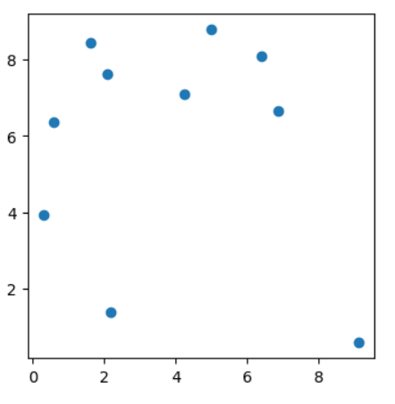
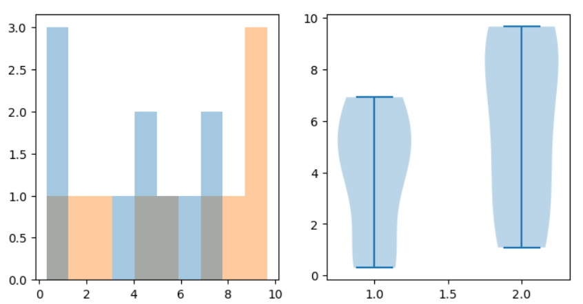

# BENG 183 HW4 Tutorial
Special thanks to Jingtian Zhou who wrote the original version of this homework in 2020. This tutorial is written to explain methods for solving the adapted version for the 2023 course.

## Preparation
To complete this homework, using Python, R, or Matlab is viable in analysis of the provided datasets, so feel free to use any of these. However, this tutorial will focus on using python to address the questions, specifically using Jupyter Notebooks for coding. 

Python is a coding language useful for analysis of data and for graphing due to the ease of reading and coding in python, as well as the numerous useful packages implemmented in python for analysis and graphing.

Below are links which can be used in order to install python and jupyter notebooks if you have not already used them:
https://wiki.python.org/moin/BeginnersGuide/Download

https://jupyter.org/install

When using jupyter notebooks, you can launch them from the command line. Lauching them from the folder in which your datasets are stored (they can also be stored in a sub-folder) is likely easiest for navigation.

Finally, we will be using a number of python packages throughout this assignment and the next. If you have not installed  these packages before, you may need to install them. After installing python, you can install the relevant packages in command line using the command line command:

```
pip install package_name
```

An example of this installing pandas specifically:

```
pip install pandas
```

You can run these commands for the variety of packages you may need to use for this assignment.

## Question 3
This problem involves performing statistical tests on the datasets given, comparing the associated columns of each dataset as the two groups for each statistical test.
In order to begin, accessing the information in the files can be done in several ways, but one common method is using PANDAS:

```python
import pandas as pd
dataset1 = pd.read_csv("Q3/dataset1.txt", sep='\t', header=None)
```
This will put the data into a pandas dataframe object, which can be accesssed as follows:

```python
dataset1.iloc[:,0] #this will give the 0th column of the dataframe
dataset1.iloc[0] #this will give the 0th row of the dataframe
```
Use these functions and others to explore the data as you complete this problem. I encourage you to look at the documentation for pandas, specifically pd.read_csv to see what each argument is signifying in this specific example. The .iloc function allows access to the dataframe for slicing the data into columns for the purpose of the statstical testing here.

Now we can import the functions for statistical tests and use them:
```python
import scipy

scipy.stats.wilcoxon
scipy.stats.ttest_rel
scipy.stats.ranksums
scipy.stats.ttest_ind
```
Each of these tests will correspond to what is being asked of you in parts A and B of questions 3, so read the questions carefully in order to determine which to use.
Look up these functions in order to read the documentation of how to call them and what values they return, but an example may resemble:

```python
scipy.stats.wilcoxon(dataset1.iloc[:,0], dataset1.iloc[:,1])
```
The remember from above that dataset1.iloc[:,0] will give a slice of the 0th column to input into the function, this will be usefull in each of these statistical test funcitons. The other functions may have slightly different parameters, so be sure to look at them in order to determine exactly how they are used. 

The final element of question 3 involves plotting the data. Using matplotlib in python is the most effective way to plot the data in order to visualizes the data. There are many tutorial online giving examples, but here is an example of what plotting may look like:

```python
import numpy as np
import matplotlib.pyplot as plt
import scipy

data1 = 10*np.random.random_sample((10,2)) #generated random data for this example

result = scipy.stats.wilcoxon(data1[:,0], data1[:,1]) #running the wilcoxon test, saving to results variable

#making a figure with 1 subplot, there are varioius ways to make a single plot, this is just one
fig, ax = plt.subplots(1,1,figsize=(4,4))
ax.scatter(data1[:,0], data1[:,1]) #making a scatterplot with the first column as x and the second as y
```




This image represents the scattered data from the randomly generated being used as an example. If you were to run this exact example on your end you would get different random points on the scatterplot due to the data generation.

When comparing the levels of expression in the datasets for this problem, you may want to add axis titles, a chart title, or a line to the plot to represent equal expression. Some useful functions for this are listed below:

```python
ax.set_xlabel() #sets xaxis title
ax.set_ylabel() #sets yaxis title
ax.set_title() #sets chart title  
ax.plot() #can plot a line on an chart
```

You can experiment with these and look them up in order to make you charts for this assignment and future use more visually appealing and informative.

Finally, you can use plots other than scatterplot to visualize the data. Here is an example of how to make a histogram or violin plot (again using random data).

```python
fig, axes = plt.subplots(1,2,figsize=(8,4)) #making 2 subplots in the figure (one row, 2 columns)

#first plot is in axes[0], we are plotting data1, which has 2 columns, resulting in 2 histograms
hist = axes[0].hist(data1, bins=10,alpha=.4, histtype="stepfilled")

#second plot on axes[1] is a violin plot which represents the data on a spectrum with probability density represented
axes[1].violinplot(data1)
```




## Question 6

This question is a bonus question, so I will provide a few functions and concepts which may be useful. 

### 6a

This question asks you to determine the null hypothesis regarding each bin. This answer should be roughly 1 sentence in length or less if you use an expression to explain the relationship.

### 6b

Some useful packages to import for this problem may include the following:

```python
import numpy as np
import scipy
import pandas as pd
from scipy.sparse import csr_matrix
from scipy.stats import poisson
```

Some important functions to consider when performing this analysis:

You are going to first want to import both edge lists for analysis, the expected (GM12878_combined_10kb_chr21.localexp.txt) and observed values (GM12878_combined_10kb_chr21.obs.txt). Use the pd.read_csv fucntion we used earlier (you may or may not need to alter the parameters of the function). From here you will have the expected and observed matrices as edge lists which you will need to convert to matrices. A function to utilize to do this is 

```python
M = csr_matrix(((M_edge.iloc[:,2], (M_edge.iloc[:,0]//resolution, M_edge.iloc[:,1]//resolution))))
```

This function will convert you edge list from an edge list to a sparse matrix. A sparse matrix conserves space on your computer by only storing elements which do not have a 0 value, which many of the bins in our observed values will have. Some things to consider about the above function:

 1. The M_edge variable is the pandas matrix of our edge list we imported with pd.read_csv. Consider what each column in the file is representing to understand what column to put in each part of the csr_matrix function.

2. We are dividing by the resolution in the dimensions of the matrix. The resolution is the size of the bins we are studying for our Hi-C interaction in order to see their relation in 3d geneome structure. The resolution is mentioned in the question, but you may want to look at the columns of the observed and expected edge lists to see what the resolution is and why we are dividing by this resolution to create a matrix of the correct size.


After converting both of your edge lists to matrices, you will be able to actually perform the analysis. There are multiple ways to do this, but here are some suggestions as to how to do this.

Fistly, you may want to use nested for loops to traverse through the matrices (i.e. the i and j dimensions of Mij and Eij). Here is an example of what a for loop looks like in python:

```python
for i in range(1,1000):
    for j in range(1,1000):
```

This for loop will count i from 1 to 1000 and for each i it will count j from 1 to 1000. For your analysis, the limits of your counting will be based on the size of the matrices and the constraints provided in the homework. You can use

```python
E.shape[1]
```

To access the size of your matrix. This will give you the first dimension of size, but the matrix is square so either dimension is acceptable. 

The constraints of the problem involved calculating the p-value at points which were Mij/Eij>1.5 and Eij>0 and 10<j-i<1000. For iterating over the matrix, you will want to consider how the index of the outer for loop (i) relates to the size of the matrix and the inner for loop (j) relates to the 10<j-i<1000. 

Note: when using these indeces to access your matrices, you don't want i or j to be bigger than the size of the matrix or you will get an error, be sure to check before accessing your matrices for values that your values will not go out of bounds.

After you have determined the bounds for the iteration through the array, you will want to check the conditions Mij/Eij>1.5 and Eij>0. You can use if statements to check for these (look them up for python if you are unfamiliar). If both are fulfilled, you can calculate the pvalue using the survival function for the poisson distrubution, which you can look up from the import of "scipy.stats poisson" we imported earlier.

You will want to store the total loops (p-value < 1e-10), as well as the smallest pvalue and the coordinates of the smallest pvalue in the plot. You can update this using if statements checking to see if a new value is lower than the previous low. Finally, for those new to programming, be sure to create these variables outside of the for loops, as otherwise they will not be stored afterwards.


## Basic example of for loops and if statements in python
For those of you completely new to python and/or programming in general, here is a basic example of how for loops and if statements work in python as well as their format. You can run this in your own notebook to get an idea of how they work.

```python
#the right boundary of the range function is exclusive, meaning it goes to this but doesn't include it
for i in range(1,5): #goes through all i from 1 to 5, not counting 5
    for j in range(1+i, 10-i): # for each i above, goes through all j from 1+i until but not including 10-i
        print(i,j)
        if j == 8: # if j is >= 8, it says so
            print("maximal value of j")
        if i * j >= 15: # if i times j is >= to 15, it says so
            print("i*j  is greater than 15")
```
