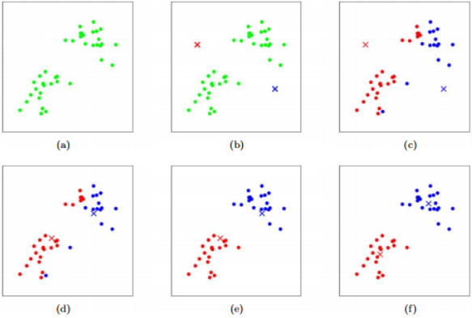
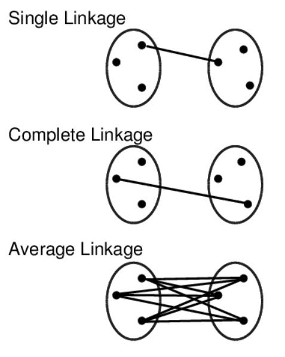
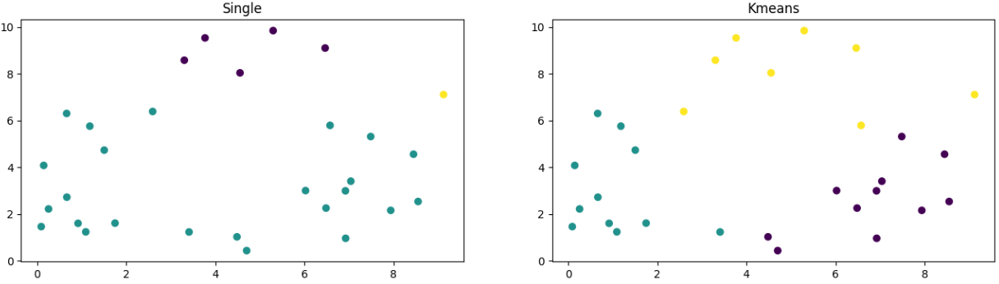

# BENG 183 HW5 Tutorial
Special thanks to Jingtian Zhou who wrote the original version of this homework in 2020. This tutorial is written to explain methods for solving the adapted version for the 2023 course.

## Preparation

Similar to HW4, this homework can be completed in a variety of programming languages such as R or Matlab, however this tutorial will focus on Python. See the links for installing python and jupyter from the HW4 tutorial, which can be found [here](HW4Tutorial.md).

## Question 2

For this problem we have datasets representing a collection of points (each row of the file being an x and y coordinate). We want to use several clustering methodologies in order to cluster the points and then plot these clustered and labeled points. 

All of the following methods of clustering are discussed in the class slides ([website link](https://systemsbio.ucsd.edu/course/beng183fa22/)) but here is a brief overview of what they are accomplishing:

K-means clustering is an algorithm which begins with a certain number of clusters which points are to be assigned to. From here, a distance vector is assigned from each point to each cluster center, with the point being placed into the nearest cluster center. This is done for all points and then new centers are calculated, and points are reassigned with new distance vectors. This process continues until the clusters converge (i.e. they no longer change) or some maximum number of iterations is reached.



Image from lecture slides


Hierarchical clustering involves calcuating the similarity between a profile (a point or cluster) and all other profiles. From here the two most similar profiles are combined to form a new profile. This new profile has its similarity to others recalculated and this process of combining profiles continues until all of the profiles are combined into one large cluster. This large cluster can be broekn apart into its smaller pieces to reveal a good cluster number for the dataset. 
There are several methods for calculating this similarity in hierarchical clustering: arithmetic mean (UPGAM), complete linkage, and single linkage.



Image courtesy of https://girke.bioinformatics.ucr.edu/GEN242/tutorials/rclustering/rclustering/


From here we can begin to implement these clustering algorithms. For this assignment our data will consist of 2 columns of x and y coordinates which will be used to calculate the distance as described in the above methodolgies. For this tutorial random data will be used to illustrate whcih functions to call and how:

```python
import numpy as np
import matplotlib.pyplot as plt
from sklearn.cluster import KMeans
from scipy.cluster.hierarchy import fcluster, linkage

data1 = 10*np.random.random_sample((30,2)) #Random sample of data for this example only

fig, axes = plt.subplots(1,2,figsize=(16,4)) #making a plot with 2 subplots

#linkage function and fccluster are scipy.cluster.hierarchy functions
links = linkage(data1, method="single")
axes[0].scatter(data1[:,0], data1[:,1], c=fcluster(links,t=3,criterion="maxclust")) #plotting the scatterplot and coloring the points with the cluster data
axes[0].set_title("Single")

# kmeans is a scipy.cluster function
kmeans = KMeans(n_clusters=3,n_init=100,random_state=0).fit(data1)
axes[1].scatter(data1[:,0], data1[:,1], c=kmeans.predict(data1)) #plotting the scatterplot and coloring the points with the cluster data
axes[1].set_title("Kmeans")
```


Above we can see the resulting plot from our analysis, in this case displaying first the single linkage plot and then the kmeans plot for clustering.
The functions for heirarchical clustering and kmeans clustering used above can be searched in the python documentation in order to determine which parameters are needed to plot the data correctly, and using all 4 of the methods necessary for the assignment (hint, change the method used on the hierarchical clustering). Additionally, ensure you are using 2 clusters for your assignemnt and not more, look at the parameters for the function in order to determine how to accomplish this.


## Question 3

For the final question, we are going to be calculating the AUROC and the AUPR for a the datasets given:

Useful Packages:
```python
import numpy as np
import pandas as pd
import scipy as scp
import sklearn as sk
from sklearn.linear_model import LogisticRegression
from sklearn import model_selection as ms
import matplotlib.pyplot as plt
from sklearn import metrics
```

The AUROC is the area under the Receiver operating characteristic curve, which is a measurement of accuracy for our linear model. This relates to the true positive rate against the false positive rate. The AUPR is the area under the precision recall curvee, which is a measurement based on the precision versus the recall of model. More information regarding these metrics can be seen in the lectures, so please reference them for additional context.

To begin, we will read in our datasets:
```python
cellA = pd.read_csv("celltypeA.txt",index_col=0, header=0)
cellB = pd.read_csv("celltypeB.txt", index_col=0, header=0)
cellC = pd.read_csv("celltypeC.txt", index_col=0, header=0)
```
These files have indeces and column headers, so the two additional arguments are necessary to put them into a dataframe correctly.

From here, an example on random data will be used to show what functions to use and how to use them. You will need to modify and repurpose this code in order to answer the questions:

```python
# generate random data
data1 = 10*np.random.random_sample((200,200))
data2 = 8*np.random.random_sample((200,200))

# combine the datasets and then create the labels for dataset 1 as positive and dataset 2 as negative
# you can reverse the positive and negative labels by switching the ones and zeros associated with each set
X1 = np.concatenate((data1, data2))
Y1 = np.concatenate((np.ones(len(data1)), np.zeros(len(data2)))) #data1 as positive(1) and data2 as negative(0)
```

Here we have created our training data for our logistic regression model, with positive and negative samples. From here, we will divide the data into testing and training sets, and then calculate the accuracy of our model in the following code:

```python
#store the values or auroc and aupr to make calculation on
aurocToAverage = []
auprToAverage = []

# score which will be later used to make calculation for aupr and auroc
score = np.zeros(len(Y1))


#this function will divide out model into training and testing data, 5 splits
stratifiedKFold = sk.model_selection.StratifiedKFold(n_splits=5, shuffle=True, random_state=0)

# this function will create our logistic regression to train on
linModel = LogisticRegression(class_weight='balanced', random_state=0, max_iter=1000)


#we will split our dataset into the splits here, the split function will break our dataset into
# the correct sizes and allow us to create 5 different training and test datasets to average over
for train_index, test_index in stratifiedKFold.split(X1,Y1):
    testX1 = X1[test_index]
    trainX1 = X1[train_index]
    trainY1 = Y1[train_index]
    testY1 = Y1[test_index]
    
    #train the linear model on our training data
    linModel.fit(trainX1, trainY1)
    
    #predict the correct labels for our test dataset
    predY =  linModel.predict_proba(testX1)[:,1]
    score[test_index] = predY.copy()
    
    # calculate the auroc and aupr and then add them to our lists to average
    aurocToAverage.append(metrics.roc_auc_score(testY1, predY))
    auprToAverage.append(metrics.average_precision_score(testY1, predY))

print("For cellA positive and cellB negative samples:")
print("AUROC:" + str((sum(aurocToAverage)/len(aurocToAverage))))
print("AUPR:" + str((sum(auprToAverage)/len(auprToAverage))))
```

From here, we will want to plot our ROC and Precision-Recall Curves. We can do this using the scores we saved in the previous step:

```python 
#calculates the false positive rate and true positive rate from our known values and our predicted scores
lr_fpr, lr_tpr, _ = sk.metrics.roc_curve(Y1, score) 
x = np.linspace(0, 10, 1000)
plt.plot(lr_fpr, lr_tpr, marker='.', label='Logistic')
plt.plot(range(1))
```

```python
#calculates the precision and recall from our known values and predicted scores
lr_precision, lr_recall, _ = sk.metrics.precision_recall_curve(Y1, score)
plt.plot(lr_recall, lr_precision, marker='.', label='Logistic')
plt.plot(range(1))
```
You will want to add labels to the axes in order to make clear what each curve is displaying for your understanding and the homework assignment. By generating these curves for the data given in the problem, you can make determinations about our machine learning model. For additional information regarding the nature of AUROC and AUPR, as well as machine learnign models used in this homework, please reference the lectures or look at documentation for these models and functions.
